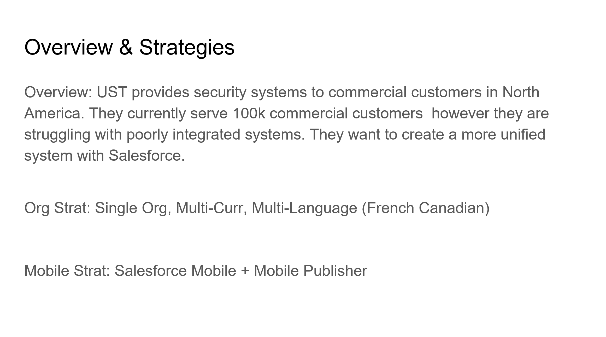
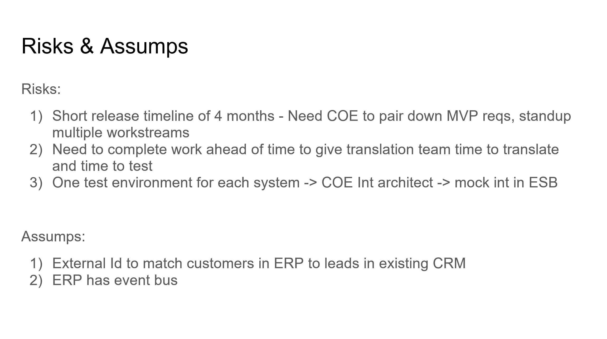
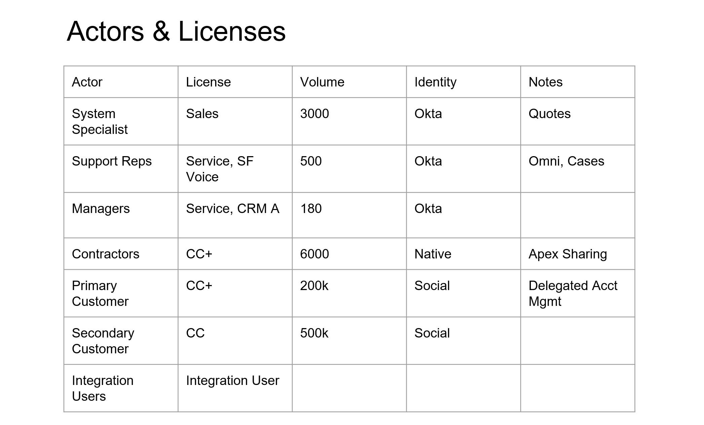
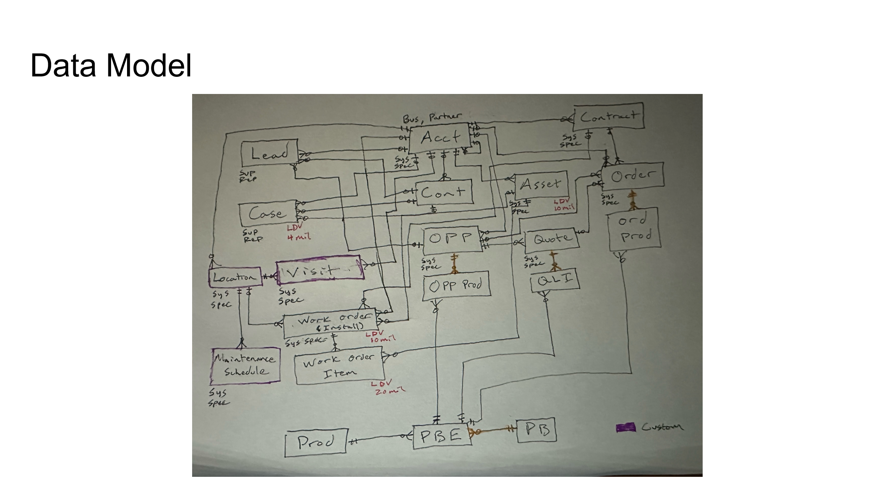
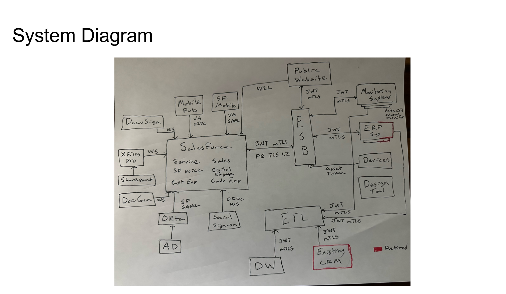
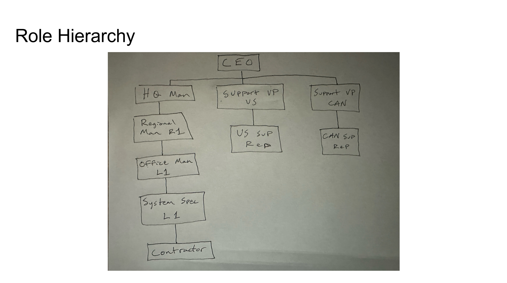
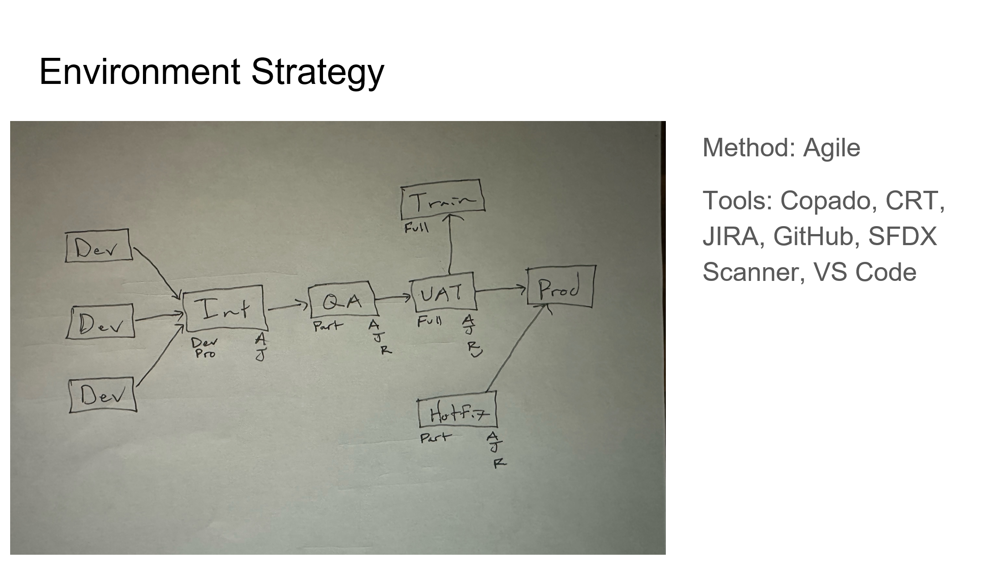

### The Important Diagrams

When presenting your solution to the CTA Board there are **ABSOLUTELY NO DIAGRAMS REQUIRED!** It is not something that is a mandatory graded part of your presentation. Your are ultimately graded on your ability to solve for the requirements written in the scenario and for your dispersal of that information when you present and do the Q&A session with your judges. With that said, **I ALSO DO NOT BELIEVE IT IS POSSIBLE TO PASS WITHOUT CREATING THE 4 DIAGRAMS LISTED BELOW.**   

Make sure however that you only use your diagrams as supporting documents to help easily visualize your solution. **DO NOT** just open your diagrams and start speaking to your diagrams out of context of the requirements. Instead, open your diagrams on the right side of your screen/monitor and your solution/google doc on the left side of your monitor. When you get to a solution within your word doc that can be visually assisted by your diagrams, pull the diagram up and explain (with the assistance of your diagram) how you are solving that solution.    

I have also added two optional diagrams at the bottom of this page to consider creating and presenting should you have the time, but again, they are not required and I wouldn't draw them unless you had a ton of extra time at the end of your scenario somehow. I personally used very minimal diagramming compared to most recommendations in the ecosystem. I only presented the four "required" diagrams listed below and nothing else. **REMEMBER** all of these required diagrams are just what I believe should be created to help tell a story easily to the judges, but if you listen to Suzanne's AMA that I listed on the home page of this site, she states that no diagrams are required, so they are not TRULY required, they are just what I think is gonna assist in your story telling the most.     

Additionally, I would make 100% of your diagrams in lucid chart, and present them via lucid chart. There is no reason to utilize google slides unless you are just a glutton for punishment or something.    

Here is a link to my suggested approach/template for creating diagrams via lucidchart to present for your CTA Review Board: [CTA Review Board Lucidchart Template](https://lucid.app/lucidchart/42853ef9-7637-431d-b625-d9fc78266f02/edit?viewport_loc=824%2C-1831%2C2071%2C4078%2C0_0&invitationId=inv_643e29dd-e2c3-449f-95bd-1f33dd0a1891).   

***

### 1) Company Overview and Org Strategy (REQUIRED)   

This is not so much a diagram as it is just a lucid chart tab where you will type up a quick overview about the company, what it is trying to achieve with this project you are solutioning for, what org strategy you are choosing to solve the client's needs (single or multi-org) and why, what mobile strategy you are choosing to solve the client's needs and why, any major risks you have identified while solving your CTA scenario (for example a really short timeline for a huge project) and how you plan to address then, and any assumptions you are making that are important to understanding your solutioning for a scenario (for instance, assuming that their ERP system already has a payment gateway you can leverage).   

**Example Company Overview and Org Strategy Tab:**  

---

### 2) Actors (User Personas) and Licenses Diagram (REQUIRED) 

This diagram is used to communicate the required Salesforce licenses for each user persona (for example a sales rep), why you are suggesting those licenses (maybe a sales rep needs a sales cloud license because they need access to the Quote object or to Opportunity Forecasting), and the amount of licenses you will need to purchase for that persona (this is important because the amount of licenses has impacts on other parts of your solution, for instance how much data and file storage are available in your org).     
     
_**The purpose of this diagram is the following:**_  
* This allows for an easy understanding of what each user persona will be doing in the system and to easily justify their licenses.  
* I would suggest including all user personas mentioned in the scenario, even if they will not actually be users in the Salesforce system so the judges know that you at least considered them and what your plan for them is, and to include all required license types for each user persona (including Salesforce feature licenses).  

**IMPORTANT NOTE:** For your CTA scenario you should not try to cut costs with the basic licenses (Sales, Service, Platform, and Experience Cloud licenses), you should just assume you have infinite money and use the license that will enable you to build the solution in its simplest form. For instance, if your Sales Reps only need a Sales Cloud license because they need access to the Opportunity object and not for anything else ABSOLUTELY DO NOT suggest a lower cost setup where you would replace the Opportunity object with a custom object so that you could give Sales Reps platform licenses instead... That is a recipe for disaster.    

**Example Actors and Licenses Diagram:**   

___

### 3) The Data Model Diagram (ERD) (REQUIRED)  

This Diagram is the MOST CRITICAL diagram to get right on the exam. Basically everything hinges on on your database/object setup. The data model (if you are unfamiliar with it) is basically the same as an ERD (entity relationship diagram).  

**_Your Data Model Diagram Should Ideally Include the Following:_**  

* Every object you are proposing for your solution, and the relationships between them.   
* An easy way to identify the custom versus standard objects used in your solution and your planned usage of each of them (making the outline of a custom object a different color for example).    
* An easy way to identify a master-detail relationship you are proposing for your solution (coloring the relationships in lucid chart a different color for instance)
* An easy way to identify Large Data Volume Objects (LDV). You should ideally make sure to label objects that are slated to house millions of records on your diagram and their volume (something simple, for example, put the acronym LDV and then the quantity of records next to it like this: "LDV:4mil").  
* A simple way of showing your OWD setting for each object (unless it's controlled by parent). You should ideally label an objects OWD settings (Private, Read, Read/Write) on the object in your data model diagram (for example you could do the following on your object in the diagram: "OWD:P" to represent an OWD of private).    
* An easy way to visualize which user personas will be the owners of the records for each object. Knowing who the owners of each records are is important to understanding whether your proposed security architecture will work. You could denote this on your objects in the following way "O: Sales Rep" as a shorthand for "Owner: Sales Rep".        

**Example Entity Relationship Diagram (ERD):**

***

### 4) The System Landscape Diagram (REQUIRED) 

The system landscape diagram will help you illustrate the different systems included within your solution and their relationships with one another (For instance, how does an ERP in your landscape integrate with your Salesforce org). 

**_Your System Landscape Diagram should ideally include the following things:_** 

* Every system mentioned within your scenario, even if it is being retired or is not at all connected to your Salesforce org.   

* An easy way to identify a retired system in your landscape (I would suggested just making the retired systems outline red or some other obvious color).   

* Your Salesforce org as well as all of the clouds, add-on products, and managed packages you are suggesting to solve your scenario.   

* Your mobile solution and how it authenticates to your Salesforce org (it's gonna use PKCE auth).   

* Your IAM (identity and access management) systems (like okta and active directory).   

* An ETL and ESB and how systems connect to your Salesforce instance through them, if your solution requires one (I've never seen one that didn't).    

* A data warehouse if your solution has large data volumes and the use of a data warehouse is justified.   

* A way to easily identify each authorization flow you are using for each system integration you are proposing. For instance, are you using JWT or OAuth to connect to your ERP system (if your scenario has one). You can easily show this by putting the flow name next to the line that indicates an integration between two systems.    

**Example System Landscape Diagram:**   

***

### 5) The Role Hierarchy Diagram (OPTIONAL)  

The role hierarchy diagram will help you to explain the roles your users will have in the system and how it will impact your sharing and visibility model.

**_The purpose of this diagram is the following:_** 

* To help explain your approach to data sharing and visibility in your CTA scenario  

**_This Diagram should ideally include the following if you decide to create it:_**

* This should include a full role hierarchy that shows how each role relates to one another. However in the case where you have multiple identical roles (ex: One role for every country an org does business in) you can just identify the first couple of roles and just indicate that more similar roles would be made for the other countries to save on time.     
* Do not forget your community/experience cloud site roles for cc+ and partner users (even the auto-generated ones)     
* Indicate any license type limitation of users assigned to the roles.     

A reminder that I would not waste time on this diagram unless you have solved every requirement and have the time to come back and make this to support your solution.    

**Example Role Hierarchy Diagram:**   

***

### 6) The Environment Diagram (OPTIONAL)

The environment diagram will help to illustrate your approach to the different SF environments (orgs and org types) you intend to use and why you intend to use them. Again this is an optional diagram, only draw this if you have a ton of left over time.   

**_The purpose of this diagram is the following:_** 

* This diagram is used to show how you intend to setup your various environments (dev sandboxes, integration, QA, UAT, Prod, etc) and to help explain why you would setup your environments that way.

**_This Diagram Should ideally Include the Following:_**

* What environment types are being used at each stage of development/deployment     
* Justification as to what sandbox type you select for each environment (dev, partial, full)     
* What will take place in each environment and what kinda testing will be involved (does development take place in the sandbox or is it a training sandbox. Are we doing Apex and Jest tests only in the sandbox or are we also doing regression and user testing?).       
* What will be deployed to each environment and when that would take place in the software development lifecycle (SDLC)           
* Include any external applications you are planning to use to get your environment pipeline up and running (ex: github, jenkins, flosum, copado, etc)

**Example Environment Diagram:**     

