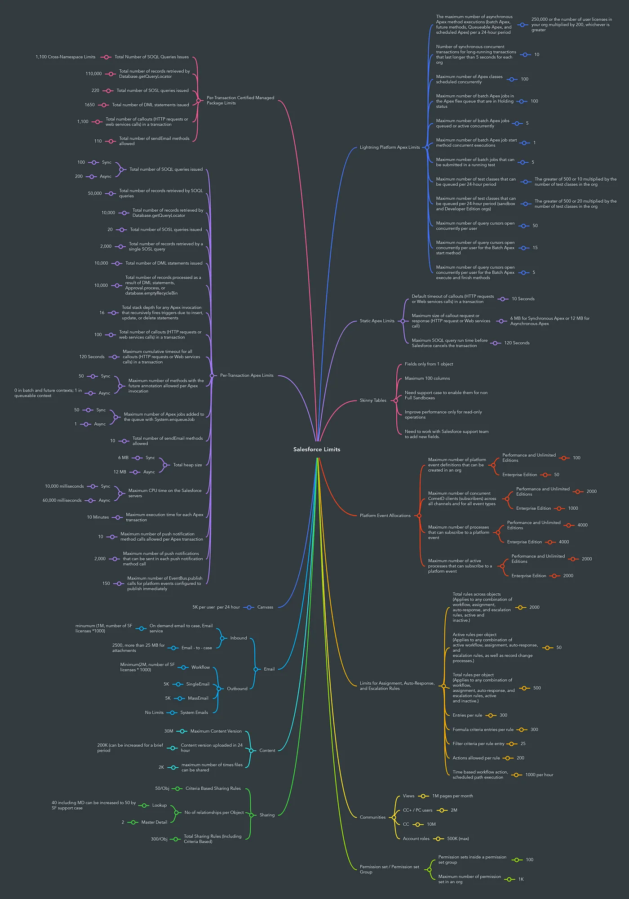

### Salesforce Limits Cheatsheet 

[Salesforce Limits Official Quick Reference Guide (Covers everything but SF functions and feature license limits)](https://developer.salesforce.com/docs/atlas.en-us.242.0.salesforce_app_limits_cheatsheet.meta/salesforce_app_limits_cheatsheet/salesforce_app_limits_overview.htm)

Quick Reference Image (Provided by Krishna Avva):  

***

### Apex Governor Limits

[SF Official Documentation on Apex Governor Limits](https://developer.salesforce.com/docs/atlas.en-us.242.0.apexcode.meta/apexcode/apex_gov_limits.htm)
***

### Licensing Governor Limits:  

[Official Salesforce Feature License Limit Documentation](https://help.salesforce.com/s/articleView?id=sf.overview_limits_general.htm&type=5)

***

### Config Limits:

***

### Salesforce Functions Limits:   

[Official Salesforce Functions Limit Documentation](https://developer.salesforce.com/docs/platform/functions/guide/limits.html)