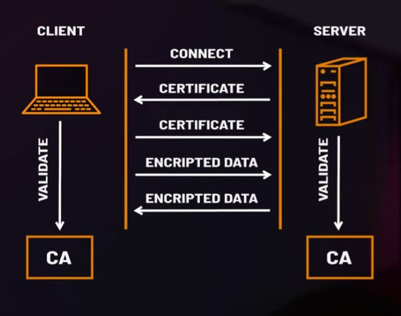

### mTLS in relevance to the CTA Board  

I don't believe this is ever something that you absolutely must call out in your system diagram, however it won't hurt, and you should be prepared for the potential for a judge to ask you about mTLS possibly, so it's good to know what it is and when to use it.  

### What is mTLS?  

mTLS is a mechanism that allows both the client application AND the server to verify they both know each other and are supposed to be communicating with each other instead of just the client verifying that they know the server.    

Below is a flow of how this works:  
   

[This video goes over mTLS in greater detail](https://www.youtube.com/watch?v=b38k2GiLDdc)

### When to use mTLS?  

mTLS should be suggested/used when you are doing a server to server integration (non-browser based integration) and with IoT device. You'd want to consider setting up mTLS between your ESB (and ETL) and Salesforce to ensure that no malicious actors were trying to impersonate your ESB and call into your SF org to make updates.   

It's important to note that platform events (and CDC) don't support mutual authentication. This is by design and will not be altered. You can view that [here](https://issues.salesforce.com/issue/a028c00000qPzGdAAK/mutual-authentication-is-not-enforced-for-platform-events-api).   

If encryption in transit is specifically called out (for both server and client) you should consider suggesting this.

### What does mTLS prevent?  

mTLS prevents the following (typically):  

1) On-Path attacks that attempt to intercept packets/traffic between systems. Because both systems communication is encrypted due to mTLS, the attacker could not decrypt the information even if they retrieved it.  

2) Spoofing Attacks that try to imitate a client application because the fake application couldn't fake who it was because it would not be able to verify itself with the sever.  

3) Credential stuffing (trying to use a username and password to auth to the server) won't work because the attacker couldn't prove (via a certificate) that it is who it is.   

### How to enable mTLS in Salesforce  

You must send in a help ticket request to enable mTLS in your org. Once you do you can setup mutual authentication in Certificate and Key management within setup. Clients will need to connect to Salesforce on port 8443. It is also suggested to setup IP restrictions in SF for that client app as well.

How to enable mTLS in SF Guide [here](https://help.salesforce.com/s/articleView?id=000382193&type=1)  
How to setup mTLS in SF Guide [here](https://help.salesforce.com/s/articleView?id=sf.security_keys_uploading_mutual_auth_cert.htm&type=5)