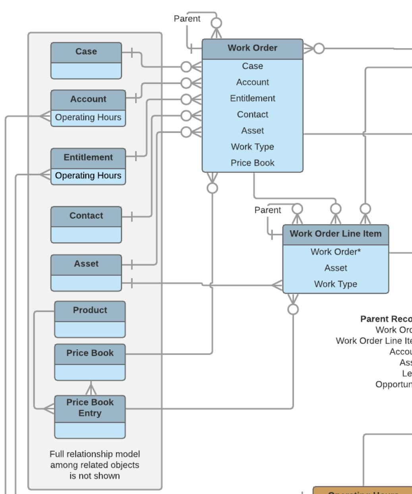

### What are Work Orders & Work Order Line Items?  

Work orders represent field service work that needs to be performed for a customer. Work order line items are the individual tasks that must be completed for that work order.  

### How to enable work orders on their own  

Setup -> Work Order Settings -> Click the "Enable Work Orders" Button

### Work Order ERD  

### Unique Capabilities of Work Orders  

1) Work Orders CAN be enabled on their own without purchasing Field Service Lightning
2) Work Orders CAN be used with entitlement processes
