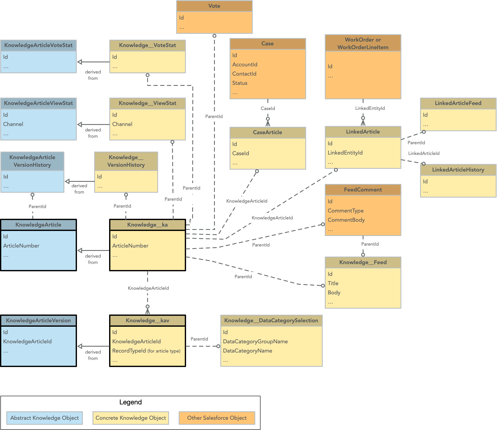

### What are Knowledge Articles  

Knowledge articles are used to help customers, partners, and internal Salesforce users self-service their own problems. Maybe a customer needs to know how to reset the tv they purchased from your company? You could have them call a rep, but why not make an easily searchable knowledge article for them to find them information themselves? Case deflection at its finest! Or make knowledge articles for your internal users to help them navigate your org!

***

### Knowledge Features  

**Scheduled Publish** - When publishing a knowledge article you have the option to schedule a future date in which it will be published. Don't forget this OOTB feature exists!  

**Public Knowledge Sharing** -   

**Knowledge Article Versioning & Version Comparison** -  

**Voting** - 

***

### Knowledge Translations  

If you go to Setup -> Knowledge Article Settings you can check a box that allows you to turn on multi-language support for Knowledge. You will also be able to select the languages you'd like to support, determine the user or queue assigned for a language translation, and the default user or queue to review the translation.  

Then when on a knowledge article there will be a button that allows you to submit for translation.

***

### Knowledge Case Suggestions

In Setup -> Knowledge Settings you will see an option that allows you to turn on knowledge article suggestions for cases and determine which fields on a case are used to find suggested articles in the OOTB case suggested articles component you can place on a case record page.

***

### Knowledge Licenses & Security  

**Knowledge Licenses** - You do have to purchase additional licenses for those users who are creating and publishing knowledge articles within Salesforce, this is an additional license and additional cost. This is a feature licenses though and doesn't need to be called out on a CTA Board, but doesn't hurt to know. People that are just viewing knowledge don't need this additional license.   

You assign this additional license by checking the "Knowledge User" checkbox on a users user record.  

**Knowledge Article Record Security** - When creating a knowledge article you have the option (via checkboxes) to determine who it is accessible to via 3 checkboxes. You can make it available to customers, partners, and/or internal users. Make sure to check the boxes for the users you want to access the articles    

**Data Categories**

***  

### Knowledge Article Topics

***

### Knowledge Classic Only Features  

There are unfortunately a ton of these, honestly if they aren't in this article above, you shouldn't learn them or suggest them imo. You don't wanna suggest classic only features on the board. It's a shame there are so many good ones they have still yet to port to lightning.

### Knowledge ERD  

