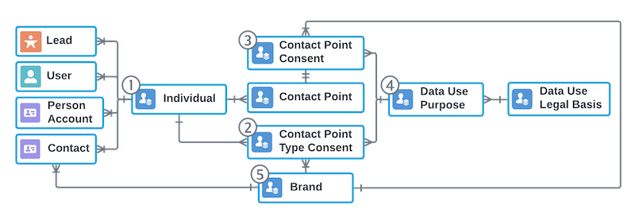

### Why Care About Consent and What Info To Capture for Consent  

We care about consent because we must abide by federal regulations (such as GDPR) around the world that give customers control over how their data is handled by businesses (and just because it's the right thing to do).  

The information we need to capture for consent management is:  
1) The Individual (contact, lead, user etc)  
2) The Data Use Purpose (Why we need the data we are capturing)  
3) The Contact Point Type (Email, Address, Phone, etc)  
4) The Capture Source (where we captured the data)  
5) Effective From & Expiration (How long we would store that data)  

***
### Core Salesforce Privacy and Consent Management  

**The Consent Management Objects**  
  

1) Individual - A way to provide a single view/golden record to link together all Contact, Person Account, Lead, User, and Employee records that represent someone in your system. The individual object is then linked to other consent mgmt objects to determine what points of contact they have approved for you to communicate with them. It also stores information about an individuals global consent choices for various communication and tracking options (opting in to geolocation tracking, email marketing, etc).    

2) Contact Point Objects (Contact Point Email, Contact Point Phone, Contact Point Address) -  These objects represent the many different points of contact for an individual, for example, if a user has 20 email addresses, 3 physical addresses, and 6 phone numbers, you would represent each of these as an individual contact point record.

3) Contact Point Consent - This object is tied to your contact point objects and determines their individual consent statuses for various communication types. 

4) Contact Point Type Consent - This is used to log the types of contact methods that an individual has stated its ok for your business to contact them with (ex: Email, Phone, Mail, etc). 

5) Brand - Brand allows you to distinguish a customers contact point consent decisions on a brand by brand basis. 

6) Data Use Purpose - In many cases you are legally required to disclose how you are using an individuals information. This object allows you to create records for those purposes and reuse those purposes across different contact point consent and contact point consent type records

7) Data Use Legal Basis - This allows you to log the legal information regarding your data use purposes.  

***

**The Levels of Consent**

1) Global Consent - This consent is managed by the individual object. If a user opts out of email on their individual object, all email communication should be turned off for that user.  

2) Engagement Channel Consent - This consent level is managed by the ContactPointTypeConsent object. This can be used to turn off communication for all Contact Points that match this contact point type. 

3) Contact Point Consent - This consent level is managed by the ContactPointConsent object and allows you to have your users opt out on a contact point by contact point basis. So they could opt out just a single email from email communications instead of all of their emails.

4) Brand Consent - This consent level allows you to get even more granular and have contacts opt out their contact points on a brand by brand basis instead of for your entire company at once.

***

**Consent Capture Managed App**  
There is a free Salesforce Labs Consent Management App called Consent Capture that can be [found here](https://appexchange.salesforce.com/appxListingDetail?listingId=a0N3A00000FMiVQUA1). It will allow you to place an easy to use (and customizable), prebuilt flow to capture consent related information.  

***

**Consent API**  

The Salesforce Consent API gives you the ability to track consent information across all objects that relate to consent management (Lead, Contact, Person Account, User, Individual, Contact Point, Contact Point Consent, Contact point type consent, Authorization form consent) in a single call. It can also be used to find duplicate users, contacts, leads, individuals, etc to allow you to easily link all these records to a parent Individual object. You can even find information for multiple emails or records in a single call.   

The Consent API cannot locate records that have the email address protected by shield platform encryption.

More information on the Consent API here: [Consent API Info](https://developer.salesforce.com/docs/atlas.en-us.api_rest.meta/api_rest/resources_consent_action.htm)

*** 

**Consent Event Stream**  

There is a special Consent Message Handler on the Salesforce Streaming API that wraps all consent objects into a single event (Lead, Contact, Person Account, User, Individual, Contact Point, Contact Point Consent, Contact point type consent, Authorization form consent). 

[Consent Management Overview Video](https://youtu.be/iBod-OOf4Zg?si=pQ0phxONM4MKqK49)

***
### Marketing Cloud Privacy and Consent Management  

This video goes over how to sync consent data from Core SF to MC:
[Video Guide on How to Sync Consent Info from Core SF to MC](https://www.youtube.com/watch?v=kB6h5fbD9xg)

Alternatively, if there is no need to sync or capture consent management info within core Salesforce, you could simply leverage the preferences center within Marketing Cloud to capture any necessary contact communication preferences for your Marketing Cloud contacts (or build a custom preferences center utilizing cloud pages).