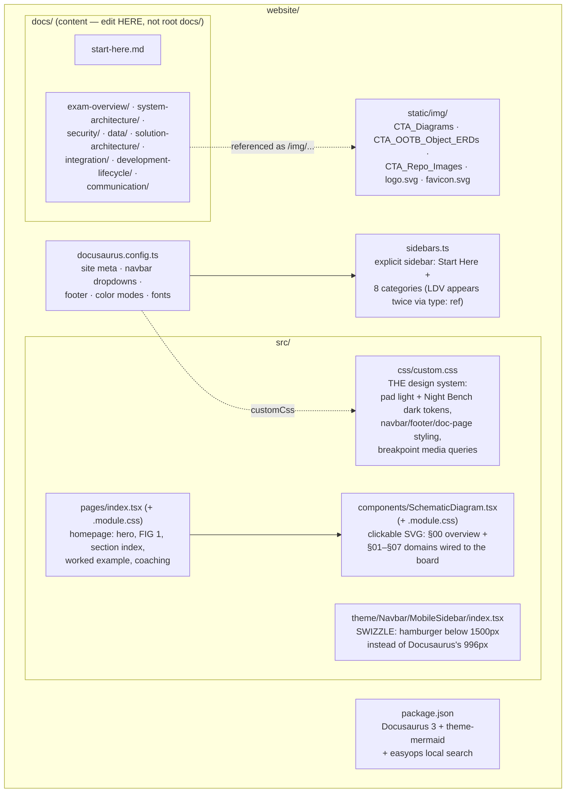
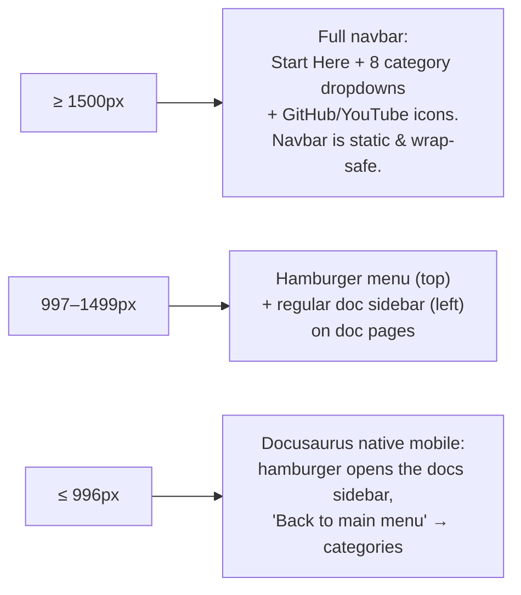

# Site Architecture — The Salesforce CTA Exam Guide

How the Docusaurus rebuild ("Schematic on the Pad" design) fits together: what lives where,
how a page gets built and deployed, and the invariants that keep the custom parts working.

Last updated: 2026-08-19 (initial Docusaurus rebuild).

---

## 1. The big picture

```mermaid
flowchart LR
    subgraph repo["Repository (main branch)"]
        content["website/docs/*.md<br/>38 study guides"]
        config["website/docusaurus.config.ts<br/>website/sidebars.ts"]
        theme["website/src/<br/>homepage + theme + CSS"]
        assets["website/static/img/<br/>diagrams & ERDs (~13 MB)"]
        legacy["docs/ + mkdocs.yml<br/>(legacy mkdocs — retired,<br/>safe to delete)"]
    end

    subgraph ci["GitHub Actions (.github/workflows/deploy-docs.yml)"]
        install["npm ci"] --> build["npm run build<br/>(docusaurus build, strict links)"]
        build --> artifact["upload-pages-artifact<br/>website/build/"]
    end

    subgraph hosting["GitHub Pages"]
        deploy["deploy-pages (OIDC)"]
        domain["the-salesforce-cta-exam-guide.com<br/>(custom domain set in repo Pages settings)"]
    end

    repo -- "push to main" --> ci
    artifact --> deploy --> domain
```



- **Everything the live site needs is under [`website/`](.).** The old mkdocs files at the repo
  root (`docs/`, `mkdocs.yml`, `setup_docs.py`) are no longer used by the build and can be
  deleted once the new site is confirmed live.
- The workflow builds with **strict link checking** (`onBrokenLinks: 'throw'`) — a broken
  internal link fails CI instead of shipping a 404.
- The custom domain is configured in **GitHub repo Settings → Pages**, not in the repo.
  `url` in `docusaurus.config.ts` must stay `https://the-salesforce-cta-exam-guide.com`
  (it drives canonicals and the sitemap).

## 2. Source layout — what each piece does



Key relationships:

| Piece | Role | Notes |
|---|---|---|
| `docusaurus.config.ts` | Single source of site-wide config | Navbar's 8 category dropdowns are defined here and must mirror `sidebars.ts` when pages are added |
| `sidebars.ts` | Doc sidebar structure | Adding a new guide = add the `.md` file **and** register it here (and in the navbar dropdown if desired) |
| `src/css/custom.css` | The whole visual theme | All colors come from `--pad-*` / `--schematic-*` CSS variables; dark mode redefines the same variables under `[data-theme='dark']` |
| `src/pages/index.tsx` | Homepage | Holds the `DOMAINS` array (numbers, blurbs, guide counts, links) — update counts here when guides are added |
| `SchematicDiagram.tsx` | FIG 1 | Click a node → `onSelectDomain` → homepage scrolls to and pulse-highlights the matching card (`domain-<key>` ids); selection state flows back down to highlight the SVG node |
| `theme/Navbar/MobileSidebar/` | Breakpoint override | See invariant #1 below |

## 3. Navigation at each screen width



The search box (offline local search — no Algolia account) and the light/dark toggle are
present at every width.

## 4. Invariants — read before touching the navbar or theme

1. **The 1500px hamburger breakpoint lives in TWO places** and they must match:
   `HAMBURGER_BELOW_PX` in `src/theme/Navbar/MobileSidebar/index.tsx` and the
   `1499px`/`1500px` media queries in `src/css/custom.css`. Docusaurus hard-codes its own
   switch at 996px; the swizzle exists solely to let the slide-out menu render above that.
2. **Never put `filter`/`backdrop-filter` on `.navbar`.** The mobile slide-out menu is a
   `position: fixed` child of the navbar; a filter makes the navbar its containing block and
   clips the menu to the navbar's box.
3. **Never set `overflow` on `.navbar-sidebar__items`.** Docusaurus slides that wrapper
   horizontally to switch main ↔ docs menu; a scroll container there blanks the menu on
   doc pages. Each panel inside it scrolls on its own.
4. **At ≥1500px, `--ifm-navbar-height` is intentionally `0`** because the navbar is static
   (scrolls away) and allowed to wrap to two rows; the sticky doc sidebar/TOC offsets derive
   from that variable. Don't "fix" it back to 4rem without also making the navbar
   fixed-height again.
5. **Markdown is CommonMark, not MDX** (`markdown.format: 'detect'` + `.md` extensions).
   That's what lets the migrated content keep raw HTML `` tags and literal `{`/`<`
   characters. Don't rename content files to `.mdx` casually.
6. **Mermaid code fences work in any guide** (```mermaid) via `@docusaurus/theme-mermaid` —
   three exist today in `integration/oauth-flows-iam.md`.

## 5. Common tasks

| Task | Where |
|---|---|
| Add/edit a study guide | `website/docs/<category>/<slug>.md` + `sidebars.ts` (+ navbar dropdown in `docusaurus.config.ts`) |
| Add an image | Drop under `website/static/img/…`, reference as `/img/…` |
| Change colors/fonts | `src/css/custom.css` variables (light in `:root`, dark under `[data-theme='dark']`) |
| Change homepage copy/counts | `src/pages/index.tsx` (`DOMAINS`, hero, stats) |
| Change the FIG 1 diagram | `src/components/SchematicDiagram.tsx` (geometry mirrors `design-mockups/21-merge-schematic-on-pad-home.html`) |
| Preview locally | `cd website && npm start` (dev) or `npm run build && npm run serve` (prod build) |
| Deploy | Commit + push to `main` — CI does the rest |

## 6. SEO layer

- **Old-URL redirects** — [`redirects.ts`](redirects.ts) maps every old mkdocs URL (e.g.
  `/06)-OAuth-Flows-&-Identity-and-Access-Management/`) to its new route via
  `@docusaurus/plugin-client-redirects`, preserving indexed rankings, backlinks, and
  bookmarks. **If a doc's route ever changes, add its old route here.**
- **`trailingSlash: true`** — directory-style URLs so GitHub Pages serves pages without a
  301 hop, matching the old mkdocs URL style the redirects catch. Don't change it.
- **Social card** — `static/img/social-card.png` (1200×630, pad-style), wired via
  `themeConfig.image`; used as `og:image`/`twitter:image` on every page. Source SVG design
  mirrors the site theme; regenerate with any SVG→PNG rasterizer if it needs edits.
- **`static/robots.txt`** — allows all crawlers and points at `/sitemap.xml` (generated
  automatically by the classic preset on every build).
- **Images** — everything in `static/img/` is compressed (lossless-ish palette PNG /
  mozjpeg, ~12MB → ~4MB). Compress new images before committing; the pristine originals
  still exist under the legacy root `docs/assets/images/`.
- **Manual/ongoing** (not in code): verify the domain in Google Search Console and submit
  the sitemap; add `description` front matter to docs; flesh out stub pages (Mulesoft,
  Service Cloud, Board Presentation Tips, Lucidchart Tips); keep external profiles
  (GitHub repo website field, YouTube) linking the custom domain.

## 7. Design lineage

The visual direction is **"Schematic on the Pad"** — mockup 21 in
[`design-mockups/`](../design-mockups/index.html) (a merge of mockup 13 *Engineer's Pad* and
mockup 20 *Schematic*). Dark mode is mockup 23 *Night Bench*. The mockup hub at
`design-mockups/index.html` documents all 23 explored directions.
